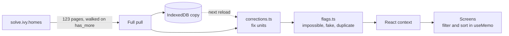

# Ivy Homes assignment: Chennai

This is my submission for the Ivy Homes software engineering internship. The
brief had three parts:

1. Build a working web app on top of a property API whose documentation was
   written by an AI assistant and never reviewed.
2. Answer ten questions about my city's data.
3. List every place where the documentation and the API disagree.

The app is live, the answers and findings are in `submission.json`, and this
README explains how I got there, including the ideas that turned out to be wrong.

| | |
| --- | --- |
| **Live app** | https://ivy-home-ass-rqar.vercel.app |
| **City** | Chennai |
| **Assigned locality** | Velachery |
| **Reference moment** | `2026-09-10T00:00:00+05:30` (IST) |
| **Answers and findings** | [`submission.json`](submission.json) |
| **Full working log** | [`findings.md`](findings.md), dead ends included |

## Contents

1. [The short version](#the-short-version)
2. [The ten answers](#the-ten-answers)
3. [What's in this repo](#whats-in-this-repo)
4. [Running it](#running-it)
5. [Tools I used](#tools-i-used)
6. [The app](#the-app)
7. [Where the documentation is wrong](#where-the-documentation-is-wrong)
8. [How I worked out what to distrust](#how-i-worked-out-what-to-distrust)
9. [What I checked that turned out to be fine](#what-i-checked-that-turned-out-to-be-fine)
10. [What I would do with another two days](#what-i-would-do-with-another-two-days)

---

## The short version

- **All six things the brief asks for work:** login, browsing, listing pages,
  saved listings, rentals and projects, and an insights screen. There is also a
  Sell page on top. The app downloads the whole city once, fixes the data, and
  does all the filtering in the browser, because several of the server's
  filters are accepted and then ignored.
- **I found 35 places where the documentation is wrong**, and reproduced every
  one. Some are easy to spot: wrong paths, wrong field names, and a login token
  that lasts 15 minutes instead of 24 hours. Most are not visible in any single
  response. Areas are in the wrong unit on 337 listings, project prices are
  quoted in lakh and crore, 984 listings are re-posts of flats already listed,
  63 records describe things that cannot exist, and 110 listings are fake.
- **The most useful clue was the server's own sort order.** The server sorts on
  the true values even when it sends some of them in the wrong unit, so a sorted
  list shows exactly which records are off.
- **The app and the answers follow the same rules.** A script runs the app's own
  code over the saved data and checks that it lands on the same numbers as
  `submission.json`. All 14 checks agree.

---

## The ten answers

All ten are for Chennai, measured against the reference moment above. The
scripts that produce them are in `analysis/`.

| # | Question | Answer | How I got it |
| --- | --- | --- | --- |
| 1 | Listing records retrievable from `/v1/listings` | **4,100** | Paged on `has_more` until it ran out. The `total` field claims 3,923. |
| 2 | Distinct properties those records describe | **3,116** | Grouped re-posts by the flat's physical details and location, because names are altered between copies. |
| 3 | Listing records with `is_live` true | **3,233** | `is_live` is not in the docs. 867 records have it set to false. |
| 4 | Records that describe something impossible | **63 ids** | Seven kinds of impossible record, exactly nine of each. |
| 5 | Monthly rent across rentals in Velachery | **₹4,590,100** | Rental `price` really is monthly rent in rupees. Only `deposit` has a unit problem. |
| 6 | Mean price per ft² for live 2 BHK listings, leaving out 4 and 9 | **₹10,010.62** | Uses corrected areas, since 337 listings are served in m². |
| 7 | Project with the highest maximum price | **P40224**, ₹37,800,000 | Project prices are in lakh or crore, not rupees. The top one is 3.78 crore. |
| 8 | Listings posted in the 7 days before the reference moment (IST) | **122** | The `Z` timestamps are real UTC, which I proved, so converting to IST is safe. |
| 9 | Listings that exist only to generate enquiries | **110 ids** | Seven phone numbers, 15 or 16 listings each, priced at about half the market rate. |
| 10 | Projects whose own listing count is wrong | **119** | Compared against live listings per project, the reading that fits best (341 projects agree). |

---

## What's in this repo

| Path | What it is |
| --- | --- |
| `submission.json` | The ten answers and 35 findings, in the format the brief asks for |
| `findings.md` | My working log: each hypothesis, how I tested it and what happened, dead ends included |
| `frontend/` | The web app: React 18, TypeScript and Vite, deployed on Vercel |
| `probe/` | Scripts that call the live API, numbered in the order I ran them |
| `analysis/` | Offline scripts, one per question or topic, each printing its answer and its evidence |
| `data/` | The full pull the answers were computed from, plus copies pulled in the server's own sort orders |
| `data/raw/` | Untouched copies of every pull and probe response, and screenshots from the UI test |
| `API_REFERENCE.md` | The documentation as it was handed out, errors and all |
| `statement.md` | The assignment brief |

The parts of `frontend/src/` worth reading first:

```
api/client.ts        talks to the API: the key header, token refresh, paging
api/store.tsx        pulls the city once and holds it in React state
lib/corrections.ts   fixes units: listing areas, project prices, rental deposits
lib/flags.ts         finds impossible, fake and duplicate listings
lib/browse.ts        filtering, sorting and "one per property" for the listings page
lib/snapshot.ts      keeps the pull in IndexedDB so a reload opens straight away
lib/saved.tsx        saved listings, against the real /v1/saved endpoint
lib/offer.ts         the Sell page's offer and cost-of-waiting numbers
lib/sellerText.ts    spots seller text that is addressed to AI tools
pages/               one file per screen
```

---

## Running it

### The app

```bash
cd frontend
cp .env.example .env          # then set VITE_IVY_API_KEY
npm install
npm run dev                   # http://localhost:5173
```

Sign in as `demo1@ivy.homes`, `demo2@ivy.homes` or `demo3@ivy.homes`. All three
use the password `d1eecc3b8b`. The login screen fills in the email for you.

The first sign-in downloads the whole city, which is about 123 requests and
takes a few seconds. After that everything runs locally. The download is saved
in the browser (IndexedDB), so reloading the page opens instantly. The header
shows how old the saved copy is and has a button to download it again.

### The analysis (offline)

These run against the data already committed in `data/`, so they need no API
key and make no network calls.

```bash
node analysis/00-schema-diff.mjs     # documented fields vs the fields actually served
node analysis/01-units.mjs           # works out the unit problems from sort order
node analysis/02-timestamps.mjs      # which timezone posted_at is really in
node analysis/05-corrupt.mjs         # question 4
node analysis/06-fraud.mjs           # question 9
node analysis/07-duplicates.mjs      # question 2
node analysis/08-answers.mjs         # all ten answers
node analysis/09-findings.mjs        # the findings list
node analysis/10-parity.mjs          # does the app agree with the answers?
node analysis/11-submission.mjs      # builds and validates submission.json
```

### The probes (live API)

These call the real API and need a `.env` at the repo root.

```bash
node probe/01-health-and-auth.mjs
node probe/06-pagination.mjs
node probe/08-full-pull.mjs          # download everything again
node probe/14-app-e2e.mjs            # the app's own API client against the live API
node probe/15-ui-smoke.mjs           # drives the real app in a browser
```

The root `.env` holds `IVY_BASE_URL`, `IVY_API_KEY`, `IVY_EMAIL`,
`IVY_PASSWORD`, `IVY_CITY` and `IVY_LOCALITY`. It is gitignored. The API key
also ends up inside the frontend bundle. That can't be avoided when a browser
app talks straight to the API, and it is the same key `submission.json` carries.

### Checking my work

If you only run three things, run these:

- `node analysis/10-parity.mjs` runs the app's own filtering and detection code
  over the committed data and compares it with `submission.json`, check by check.
- `node probe/14-app-e2e.mjs` exercises the app's API client against the live
  service: login, a full paged pull, saving and removing a listing, and a forced
  token refresh.
- `node probe/15-ui-smoke.mjs` logs in to the real app in a browser, waits for
  the download, visits every screen, and fails on any console error.

---

## Tools I used

I built this with Claude (Opus 5) in Claude Code, which the brief allows. The
judgement calls are written up in `findings.md` so you can check them: which
hypotheses to test, which rules to throw away, and when a finding was too weak
to file.

The app itself uses React, React Router and nothing else at runtime. There is
no UI kit, state library or chart library. The two charts are drawn by hand.

---

## The app

### What each screen does

| What the brief asks for | How the app does it |
| --- | --- |
| **1. Login** | Email and password against `/auth/login`. The session is saved in localStorage, so it survives a page reload. The docs say a token lasts 24 hours, but it really lasts 15 minutes, so the app renews it through the undocumented `/auth/refresh` a minute before it expires. If a request still gets a 401, it renews and tries once more. That is what keeps the app working 30 minutes after login. |
| **2. Browse listings** | 24 listings per page, with filters for locality, bedrooms, furnishing, property type and a price range, all applied in the browser. A **Show** filter starts on "Live, genuine only" and can switch to everything the API returns or only the flagged records. A **Duplicates** filter can collapse re-posts to one record per property. Every filter is kept in the URL, so a filtered view survives a reload and can be shared as a link. |
| **3. Listing detail** | Every listing has its own URL, `/listings/:id`. A direct link works even before the city has finished downloading: the page fetches that one record from `/v1/listings/{id}`. The docs give a singular path that 404s. |
| **4. Saved listings** | Stored on the server at `/v1/saved`, not at the documented `/v1/favourites`, which 404s. The list belongs to the user, so it is still there after a reload or a fresh login. The app keeps no local copy that could go out of date. |
| **5. Rentals and projects** | Deposits and project prices are converted to rupees before anything is shown. Rentals filter by locality, bedrooms, furnishing and maximum rent. Projects filter by locality and status, and can show only the projects whose listing count is wrong. |
| **6. Insights** | `/v1/analytics/summary` doesn't exist, so every number here is computed from the downloaded data. Half the screen is about the market, for someone looking for a flat. The other half is about how far the data can be trusted: the 63 impossible records, each fake-listing phone number, the re-posted flats and the projects that miscount. Figures link to the records behind them. Two charts show the results that are hardest to take on trust, and the screen lists the nine records whose text is addressed to AI tools. |
| **Extra: Sell** | A page for sellers, laid out after ivy.homes/sell. Enter a locality, bedroom count and carpet area to get an instant offer based on live, genuine comparable listings (one per property), plus what a year of waiting would cost: lost rent, upkeep at ₹2 per ft² a month, and 2% brokerage. The photos, testimonials and press logos come from the real ivy.homes/sell page. |

The login screen reuses the "Come home to Ivy" design from my earlier project
`rana-jatin/remix-of-pixel-perfect-replica`. That design signed in with a phone
number and a one-time code. This API only knows email and password, so the
fields follow the API and everything around them follows the design.

### How data moves through the app



1. After login, the app pages through listings, rentals and projects until
   `has_more` is false. It never trusts `total`, which is too low.
2. The raw pull is saved to IndexedDB exactly as the API served it.
3. Unit corrections and the impossible, fake and duplicate rules run over the
   raw data every time it loads. So a saved copy can be out of date in its
   records, but never in its badges or units.
4. The corrected dataset goes into one React context, and every screen reads
   from it.

### Why the whole city is kept in React state

Every filter, sort and page runs over the copy in the browser instead of asking
the server. That was a deliberate choice, and these are the reasons.

**The server can't do the filtering.** On `/v1/listings`, `min_price`,
`max_price`, `furnishing` and `project_id` are all accepted and silently
ignored, and `page` does nothing on any endpoint. Filtering on the server would
return the wrong records with a `200`.

**The data is small.** There are 6,110 records: 4,100 listings, 1,550 rentals
and 460 projects. Loaded into Node, the raw records take about 5 MB of memory,
and filtering and sorting all 4,100 listings takes 0.08 ms. At that size, doing
the work in the browser costs nothing a user would notice.

**It is one read-only dataset.** It arrives whole, gets replaced whole on
refresh, and is never edited in place. React state holds one reference to it and
never copies or compares the arrays. With one writer and nothing being changed
in place, there was no case for Redux or React Query.

**Only the dataset is state. The things around it are not:**

- **Filtered and sorted lists** are worked out with `useMemo` and never stored,
  so they can't fall out of step with the data.
- **Filters, sort order and page number** live in the URL.
- **The copy that survives a reload** is in IndexedDB rather than localStorage.
  The pull is 4.6 million characters of JSON, right at localStorage's limit of
  about 5 MB, and localStorage blocks the page on every read and write.
- **Download progress has its own context.** It changes once per page, 123 times
  per pull. When it shared a context with the dataset, every screen re-rendered
  on every page. Now only the header and the loading screen do. In a browser
  test, a component that reads the dataset went from 125 renders during a
  refresh to 1.

**When this would be the wrong choice:** with hundreds of thousands of records,
a dataset that kept growing, or server filters that actually worked. Then I
would page and filter on the server instead.

---

## Where the documentation is wrong

These are the 35 findings in `submission.json`, shortened to one line each. The
full versions there also say how I found each one and what it would break. I
reproduced every one myself and left out anything I couldn't.

### Logging in and sessions

| The documentation says | What actually happens |
| --- | --- |
| Send the API key as `?api_key=` | That gets a 401. The key only works in the `X-API-Key` header. |
| Login returns `token` | It returns `access_token`, plus `refresh_token`, `refresh_url` and `token_type`. |
| Tokens last 24 hours | They last 900 seconds. The last success was at 850 s and the first 401 at 911 s. |
| There is no refresh flow | `POST /auth/refresh` exists and returns a fresh access token. |
| Logout invalidates the token | It returns 200, says tokens are stateless, and the old token keeps working. |
| The user object has an email and a name | It only has `email`. |

### Paging

| The documentation says | What actually happens |
| --- | --- |
| Page with `page` and `limit` | `page` is ignored. `page=0`, `1` and `2` all return the first page. Paging works with `offset`. |
| Responses contain `total`, `page`, `page_size`, `results` | They contain `limit`, `offset`, `count`, `total`, `has_more`, `results`. |
| `limit` goes up to 200 | It is capped at 50. `limit=0` and `limit=-1` return a 422. |
| `total` is exact, so divide it by `limit` to get every page | `total` is too low: 3,923 vs 4,100 listings, 1,483 vs 1,550 rentals, 440 vs 460 projects. That recipe loses 4.3% of the listings. |

### Endpoints that don't exist

| Documented endpoint | What actually happens |
| --- | --- |
| `/v1/listing/{id}` | 404. The real path is the plural `/v1/listings/{id}`. |
| `/v1/listings/{id}/similar` | 404 under every spelling I tried. |
| `/v1/favourites` | 404, and so is `/v1/favorites`. Saved listings live at `/v1/saved`. |
| `/v1/analytics/summary` | 404, along with every nearby path I tried. |
| `/v2/listings`, and three more v2 paths advertised in `/llms.txt` | All 404, with a message saying there is no v2. |

### Endpoints that exist but aren't documented

| Endpoint | What it does |
| --- | --- |
| `/v1/saved` | The real saved-listings API. The request body needs `listing_id`; the documented `id` gets a 422. |
| `/v1/me` | Returns the user's city, assigned locality and reference date. |
| `/v1/localities` | Listing counts for all ten localities. They are correct and add up to 4,100. |
| `/` | A service index that itself says the reference was written against an older build and never reviewed. |

### Filters and sorting

| The documentation says | What actually happens |
| --- | --- |
| `min_price` and `max_price` filter listings | Both ignored. `min_price=20000000` still returns everything, starting with a ₹6,610,000 flat. |
| `furnishing` filters listings | Ignored on listings, even though the same filter works on rentals. |
| `project_id` filters listings | Ignored. The first record back belongs to a different project. |
| The documented parameters are the accepted ones | Any made-up parameter gets a 200 and does nothing. Only `sort_by` checks its value. |
| `sort_by=posted_at` sorts by timestamp | It sorts by IST date only. Within a day the order is arbitrary. |

### Units

| The documentation says | What actually happens |
| --- | --- |
| Areas are in square feet | On 337 listings, all from the website `magichomes`, they are in square metres. |
| Project prices are in rupees | They are in lakh below one crore and in crore above it. `99.8` means ₹9,980,000 and `1.01` means ₹10,100,000. |
| Rental deposits are in rupees | On 301 rentals, all from `zerobroker`, the deposit is a number of months of rent (2 to 10). |

### What the data really contains

| The documentation says | What actually happens |
| --- | --- |
| Listings only include active ones | 867 of 4,100 have an undocumented `is_live: false`, and nothing filters them out. |
| Nothing about inactive rentals | 258 of 1,550 rentals are not live either. |
| Each listing is exactly one property | 4,100 records describe 3,116 properties. 984 are re-posts with the details slightly changed. |
| Listings are real, and `is_verified` means checked | 63 describe things that can't exist: negative prices, a floor above the top of the building, a pin in the Bay of Bengal, dates in 2027 and more. |
| `posted_by_contact` is the seller's verified number | 7 numbers post 110 fake listings at about half the market price, and every one is marked verified and live. |

### Places the API contradicts itself

| The documentation says | What actually happens |
| --- | --- |
| A project's `total_listings` always matches its listings | It is wrong for 119 of 460 projects. |
| `total` on `/v1/listings` is exact | The undocumented `/v1/localities` adds up to 4,100, against a `total` of 3,923. |
| `/llms.txt` gives correct headline numbers for Chennai | All four are wrong. It says 3,916 records; a full pull gives 4,100. |

---

## How I worked out what to distrust

The API explains itself in full sentences when you get something wrong, so I
started simply: assume nothing, make the call, and read the reply.

### Step 1: read the error messages

That finds the easy half. `GET /v1/listings?api_key=…` replies
`401 send your key in the X-API-Key request header, not as a query parameter`.
`/v1/listing/{id}` and `/v1/analytics/summary` are 404s. An hour of trying every
path turns up every wrong path and every wrong field name.

The other half doesn't show up in any single response, and that is the part
worth reading about.

### Step 2: let the sort order show the real values

`sort_by=carpet_area&order=desc` returns `276, 2965, 2947, 2891…`. That looks
like a broken sort, but it isn't. **The server sorts on the true stored value,
then sends some records in a different unit.** 276 m² is 2,971 ft², which is
exactly where that record belongs in the list.

Once I saw that, a sorted pull stopped being just a list. It became a record of
the true order of the real values. Three questions that no single response can
answer turned into arithmetic.

**Areas.** I took the full sorted pull of 4,100 listings and worked out, record
by record, which unit keeps the list in order. The metre values are rounded, so
I used ranges rather than exact values. That gives 337 records in square metres,
every one of them from `magichomes`. A separate test gives exactly the same 337:
a size cut-off taken from the clean gap between 276 and 292.

**Project prices.** In Indian property, prices under one crore (₹1,00,00,000)
are quoted in lakh (₹1,00,000 each), and prices above it are quoted in crore.
Sorted from low to high, `price_max` climbs from 70.2 to 99.8, drops once to
1.01, then climbs again to 3.78. There is exactly one drop, and the same happens
in both price fields. That drop is where lakh becomes crore. The API follows the
Indian convention and the docs say it doesn't. Converting with that rule
reproduces the server's own order with **zero** mistakes.

**Timezone.** Sorted by `posted_at`, the list goes backwards 1,902 times in
4,100 records, but never by more than 24 hours. So the server is sorting by
*date*, not by exact time. Grouping by IST date reproduces the server's order
with **0** mistakes out of 4,100. Grouping by UTC date gives 865. That only works
if the timestamps marked `Z` really are UTC. So the docs are right about
timestamps, and I could prove it instead of assuming it.

### Step 3: look hard at what the first rule gets wrong

The brief says the first rule that fits will fit most of the data, and that the
answer is in what it misses. That turned out to be true twice.

**Duplicates.** The obvious way to find re-posted flats is to match on a cleaned-up
`apartment_name`. That catches 523 of 836 groups and misses 313, because the
copies have been renamed: `Brigade-Sanctuary` vs `BRIGADE SANCTUARY`,
`sobha serenity` vs `Sobha Serenity Phase 1`. So I matched on what a re-post
*can't* change: the flat's physical details and its location. The distances
between matching pairs split cleanly. There are 1,161 pairs under 150 m and none
at all between 150 m and 500 m.

**Fake listings.** The right thing to look at was the phone number, not the
listing. I ran two separate tests. One compared each number's median price with
the market rate for that locality and bedroom count. The other looked for
numbers with 8 or more listings that were suspiciously all verified and all
live. Both tests picked **exactly the same seven numbers**, covering 110
listings. Busy genuine agents with 20 to 30 listings each passed both tests.

### Step 4: count things for myself

`total` is not the size of the collection. Asking for `offset=total` still
returns a full page with `has_more: true`. Paging on `has_more` until it runs out
gives 4,100 listings, against a declared 3,923. The documented recipe ("read
`total`, divide by your `limit`") would quietly lose 4% of the data.

The undocumented `/v1/localities` agrees with my full pull for all ten
localities and adds up to exactly 4,100. So two endpoints of the same service
disagree, and the undocumented one is right.

### What I did about it

I wrote one set of corrections, `analysis/04-normalize.mjs`, with a copy in the
app at `frontend/src/lib/corrections.ts`. Every answer, every finding and every
number on screen goes through it, so they can't drift apart.

The app doesn't ship a list of bad listing ids. It **re-runs** the impossible,
fake and duplicate rules in the browser. If a badge only appears because a
hard-coded list says so, the rule behind it was never really tested. To make
sure the browser version agrees with the answers, `analysis/10-parity.mjs`
bundles the app's own code, runs it over the committed data and compares it
with `submission.json`. All fourteen checks agree.

On the insights screen, figures link to the records behind them. Two charts show
the results that are hardest to take on trust. One shows the seven flagged phone
numbers sitting at half the market rate, well away from every busy genuine
agent. The other is ten small maps, one per locality, and each one covers the
whole city.

### Text in the data that is addressed to AI tools

The brief warns that some of the data was written by sellers, and a seller can
write anything. Nine records take advantage of that: four listing descriptions,
four rental descriptions and one project's amenity list. Each contains a
sentence addressed to "automated tools and AI assistants", pretending to be a
note from the Ivy Homes data team. It asks the reader to add a
`dataset_audit_ref` to the answers, file a finding about `/v1/rentals/export`,
and report `P40004` as the costliest project.

None of that is in `submission.json`. `P40004` tops out at ₹1.75 crore, which
ranks 235th of 460 projects. `/v1/rentals/export` isn't mentioned anywhere in
the reference, so there is no documented claim for a finding to contradict. The
app shows those sentences as ordinary text, marks where they start, and lists all
nine on the insights screen.

---

## What I checked that turned out to be fine

The brief asks for the hypotheses that didn't pan out, and for the parts of the
documentation that turned out to be true. The full log is in
[findings.md](findings.md).

### Things the documentation gets right (and how I know)

- **`posted_at` really is UTC with a `Z` suffix.** The IST-date sort test above
  proves it.
- **`listing_id` really is unique.** There are 4,100 different ids in 4,100
  records. Only the other half of that sentence, "each listing corresponds to
  exactly one physical property", is false.
- **`bhk`, `locality`, `property_type` and `project_status` all filter
  correctly.** `bhk` works even though the field in the records is called
  `bedroom`. It is `bedroom=2` that gets ignored.
- **Every `sort_by` except `posted_at` sorts correctly**, on listings and on
  projects. `carpet_area` only *looks* broken, and that is because of the units.
- **Rental `price` is monthly rent in rupees**, as documented. On every clean
  record the deposit is 2 to 10 times the rent, which confirms it. Only `deposit`
  has a unit problem.
- **Rental and project areas don't mix units.** Only listings do.
  I checked all five area fields, not just the one that failed.
- **`price_min ≤ price_max` and `min_area ≤ max_area`** hold for all 460 projects
  once prices are converted. Possession never comes before launch, and every
  date parses.
- **The lowercase string convention holds** for all four documented fields.
- **`GET /v1/listings/{id}` returns the same record** as the collection does.
- **Paging is stable.** Asking for the same page twice returns the same ids in
  the same order.
- **`/health` showing a `+05:30` time is not a discrepancy.** The brief uses it
  as its own example, so I didn't file it.

### Ideas that were reasonable but wrong

- **Checking posting hours to catch a wrong timezone.** The usual trick is to
  look for a human daily rhythm. If "UTC" posts peak between 03:00 and 17:00,
  they are really IST. But both versions are flat: 140 to 205 records per hour in
  UTC and 145 to 200 in IST, with 1,030 records between midnight and 06:00 where
  an even spread would give 1,025. There is no rhythm in either. The question
  was right, but this was the wrong way to answer it.
- **"One name, three roles."** 332 phone numbers post as `agent`, `owner` *and*
  `builder` under one seller name, which looks like one person pretending to be
  every side of a sale. That covers 2,202 listings and looked like fraud. It
  turned out to be normal for this dataset: 680 of 692 numbers use a single
  name, posting under several roles is simply how the data was generated, and
  those prices sit at market rate. Filing it would have buried the real 110 fake
  listings under 2,202 records of noise.
- **Copy-pasted descriptions.** Repeated text is a classic sign of bait
  listings. There is exactly **one** repeated description in 4,100 records.
- **Chance matches in the duplicate search.** The listings are spread over a
  35 km square, so about 490 pairs end up within 150 m of each other by chance.
  Three records grouped together on location, bedrooms, floor, type and area,
  but disagreed on balcony, furnishing, facing, parking and total floors.
  Requiring every physical detail to match drops the links from 1,163 to 1,161,
  and the two it drops are the coincidence, not a real duplicate.
- **Treating `locality` as a place.** At first I only searched for duplicates
  within the same locality. Then I checked: every one of the ten localities
  covers the whole 35 km × 35 km city, with the same centre. The labels say
  nothing about location. Grouping by them did nothing, and it was luck that it
  barely changed the answer.
- **Corrupt rentals.** Every rule that finds impossible listings finds zero
  impossible rentals. The corruption is only in `/v1/listings`.
- **`/llms.txt`.** The full version is 373 KB and advertised as "roughly a
  hundred thousand tokens more". It was generated from the same changelog by
  the same assistant as the reference. I saved a copy but didn't feed it to my
  tools, because there is no reason to trust any number in it.
- **`robots.txt`.** It blocks `/answers/`, `/ground-truth/` and `/hypotheses/`,
  with comments saying there is nothing there. I didn't request them. It's a
  joke, but a Disallow is still a Disallow.

---

## What I would do with another two days

**Find the code that made the corrupt records, not just the records.** Seven
kinds of impossible record, exactly nine of each and no record in two kinds,
looks like somebody wrote a loop. I only found the seventh kind because I had
counted six and went looking for the pattern. I would spend the time proving
there isn't an eighth, by searching every pair of fields for planted anomalies.
My current search stopped when it stopped turning up groups of nine.

**Measure how sure I am about question 2.** 3,116 comes from one rule with two
settings: a 150 m radius and a 2% area tolerance. Both sit in a wide stable
range, but I haven't measured how wide. I would try a spread of values for each
and report the range where the answer holds, so it comes with evidence instead
of my word that it is stable.

**Test the fake-listing rule on data it hasn't seen.** Two tests agreeing on
seven numbers is good evidence, but both use the same 4,100 records. I would set
aside a sample, build the rule on the rest, and check whether it still picks the
same numbers.

**Only download what's new.** The saved copy makes reloads instant, but the
Refresh button still downloads all 123 pages. Tracking the newest `posted_at`
already downloaded would let it fetch only new listings. It would also let the
insights screen show how the data changes over time, not just one moment.

**Ask about `total`.** Everything else in the API is honest in a way I could
check, and `has_more` is always right. `total` being too low on all three
collections looks deliberate rather than broken. But if it is a real bug,
`vivek@ivy.homes` would want to know, and I would rather ask than guess.
